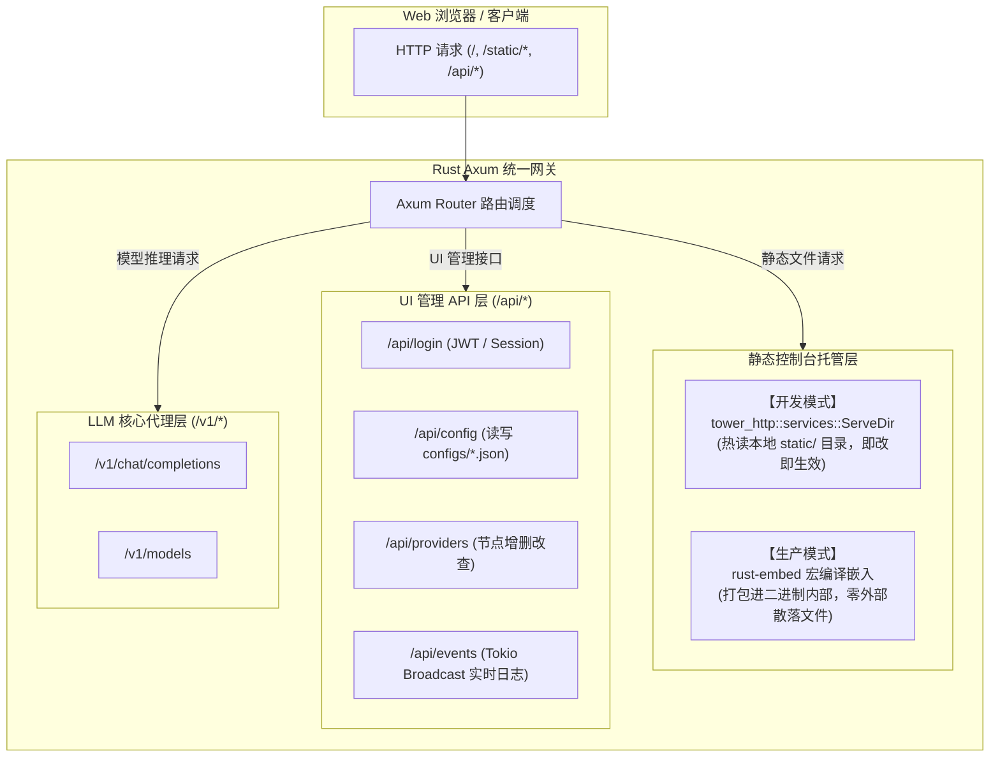

# AIClient2API 核心重构为 Rust 的工程架构与实施方案

> **文档定位**：针对 AIClient2API 项目从 Node.js 体系向 Rust 高性能体系演进的完整工程架构蓝图。  
> **核心原则**：性能断崖式提升、单二进制 All-in-One、**Web 管理控制台零重写复用**、用户体验与配置 100% 向后兼容。

---

## 一、 背景与重构动因

### 1.1 现状与规模
AIClient2API 作为统一转换各大客户端私有大模型协议（Antigravity、Codex、Grok、Kiro 等）至 OpenAI 兼容接口的反向代理，已在社区获得广泛认可（Docker 下载量超过 10 万次，Trendshift #2）。当前服务端基于 Node.js/TypeScript 构建，前端管理后台为纯静态原生 Web 应用。

### 1.2 核心痛点
1. **长连接流式代理的内存与 GC 压力**：
   - 大模型文本生成是典型的长时间、高并发 Server-Sent Events (SSE) 流。Node.js V8 运行时在维持海量长连接并对高频打字机 Chunk 做反复的字符串切分、反序列化与再序列化时，堆内存常驻达 **150MB ~ 400MB**。
   - V8 垃圾回收（GC）引起的偶发停顿会导致客户端（如 Cursor、Claude Code）打字机流产生微小卡顿。
2. **容器镜像臃肿与低功耗设备部署阻力**：
   - 基础镜像包含 Node.js 运行环境与庞大的 `node_modules`，镜像体积通常在 **300MB ~ 500MB**。
   - 大量用户将服务部署在入门级 Linux NAS（如群晖、飞牛私有云）或 512MB/1GB 内存的低配 VPS 上，现有内存与镜像开销使得部署门槛偏高。
3. **私有协议多态转换的动态类型脆弱性**：
   - 各上游私有 API 数据结构复杂、响应多变。当前基于 JavaScript 的转换层依赖大量可选链（如 `res?.candidates?.[0]?.content?.parts...`），在极端异常响应下难以在编译期穷尽分支，偶发未捕获异常。
4. **外部运行环境依赖**：
   - 非 Docker 裸机运行需要用户预先安装匹配版本的 Node.js、pnpm 及构建工具，缺少原生独立执行文件的开箱即用体验。

---

## 二、 核心收益指标对齐

| 核心指标 | Node.js 原版 | Rust 重构版 | 预期收益 |
| :--- | :--- | :--- | :--- |
| **常驻内存开销** | 150MB ~ 400MB | **15MB ~ 25MB** | **降低 90%+**，低配设备无感常驻 |
| **Docker 镜像尺寸** | 300MB ~ 500MB | **< 20MB (Scratch/Alpine)** | **减少 95%**，秒级拉取启动 |
| **单连接中继时延** | 5ms ~ 15ms（含 GC 抖动） | **< 0.5ms（零拷贝流水线）** | 消除打字机微卡顿，高并发无抖动 |
| **分发与运行形态** | Node.js + node_modules 目录 | **单一静态二进制文件** | 双击即跑，零外部依赖 |
| **Web 控制台** | 静态文件服务 | **100% 保持不变（编译内嵌）** | **零前端改动，用户体验完全无缝** |
| **配置兼容性** | `configs/*.json` | `configs/*.json`（100% 兼容） | 无需数据迁移，平滑直接覆盖 |

---

## 三、 Web 控制台 100% 零修改复用方案

### 3.1 前端架构现状
审查项目 [`static/`](../static/) 目录结构：
```text
static/
├── index.html, login.html, potluck.html ... (主入口页面)
├── app/ (原生 ES Modules: auth.js, i18n.js, language-switcher.js ...)
└── components/ (UI 组件样式与脚本)
```
整个 Web 控制台为标准的纯前端单页/多页应用（SPA/MPA），**不含任何 Node.js 服务端渲染（SSR）代码**。其与后端的交互完全基于标准 Web 协议：
- **静态资源拉取**：GET `/`、`/static/*`、各类 `.html`、`.css`、`.js`、`.png`。
- **RESTful 管理接口**：`/api/login`、`/api/config`、`/api/providers/*`、`/api/system`、`/api/usage`。
- **实时事件推送**：GET `/api/events`（基于标准 `text/event-stream` SSE）。

### 3.2 Rust 端的双模式承载设计



#### 生产模式：利用 `rust-embed` 实现单二进制自包含
在正式构建发布时，通过 `rust-embed` 宏将整个 `static/` 文件夹直接压缩内嵌到 Rust 二进制中：

```rust
use rust_embed::RustEmbed;
use axum::{
    response::{IntoResponse, Response},
    http::{header, StatusCode, Uri},
};

#[derive(RustEmbed)]
#[folder = "static/"]
pub struct StaticAssets;

pub async fn static_handler(uri: Uri) -> impl IntoResponse {
    let mut path = uri.path().trim_start_matches('/').to_string();
    if path.is_empty() || path == "index.html" {
        path = "index.html".to_string();
    }

    match StaticAssets::get(&path) {
        Some(content) => {
            let mime = mime_guess::from_path(&path).first_or_octet_stream();
            ([(header::CONTENT_TYPE, mime.as_ref())], content.data).into_response()
        }
        None => (StatusCode::NOT_FOUND, "404 Not Found").into_response(),
    }
}
```

**体验保证**：用户启动编译好的 `aiclient2api` 二进制程序，在浏览器打开 `http://127.0.0.1:8080`，看到的界面、多语言国际化（i18n）、主题切换、移动端适配布局与原版 Node 表现 **100% 毫无二致**。

---

## 四、 核心重构架构与模块设计

### 4.1 系统分层架构

```
┌────────────────────────────────────────────────────────┐
│              客户端层 (Cursor / Claude Code / 浏览器)    │
└───────────────────────────┬────────────────────────────┘
                            │ HTTP / SSE / WebSocket
┌───────────────────────────▼────────────────────────────┐
│      网关接入层 (Axum 0.8 + Tower-HTTP + Tokio)         │
│  - 安全中间件 (Bearer Token / API Key / CORS / 限流)     │
│  - 路由分流: /v1/* (LLM) | /api/* (UI) | /* (静态控制台) │
├────────────────────────────────────────────────────────┤
│      核心路由与连接调度 (ProviderPoolManager)            │
│  - 节点状态管理与健康巡检 (Active / Standby / Cooldown)  │
│  - 负载均衡 (Round Robin / Weighted / Priority)        │
│  - 上游 HTTP 连接池复用 (Reqwest Connection Pooling)    │
├────────────────────────────────────────────────────────┤
│      多协议转换引擎 (Protocol Adapters)                  │
│  - 统一中间模型 (Unified Chat IR)                       │
│  - 双向适配器: OpenAI <-> Gemini / Claude / Codex / Grok│
│  - 零拷贝 SSE 流式切片器 (Zero-Copy Frame Transform)    │
├────────────────────────────────────────────────────────┤
│      系统底层与持久化层                                  │
│  - 配置管理: configs/ 目录兼容读写 (serde_json)          │
│  - 凭据缓存与轮转: TokenStore (OAuth 2.0 Auto Refresh)  │
│  - 异步事件总线: tokio::sync::broadcast 实时推送        │
└────────────────────────────────────────────────────────┘
```

### 4.2 零拷贝（Zero-Copy）SSE 流式中继实现
为了达到极致时延与低内存开销，重构的核心在于废弃字符串中转，采用基于分块字节的流水线：

```rust
use axum::response::sse::{Event, KeepAlive, Sse};
use futures_util::{Stream, StreamExt};
use bytes::Bytes;
use std::convert::Infallible;

pub async fn proxy_chat_stream(
    upstream_stream: impl Stream<Item = Result<Bytes, reqwest::Error>> + Send + 'static,
    adapter: Arc<dyn ProtocolAdapter>,
) -> Sse<impl Stream<Item = Result<Event, Infallible>>> {
    let transformed_stream = upstream_stream
        .filter_map(move |chunk_result| {
            let adapter = Arc::clone(&adapter);
            async move {
                match chunk_result {
                    Ok(bytes) => {
                        // 零拷贝借用字节切片做协议识别与重封包
                        match adapter.adapt_stream_chunk(&bytes) {
                            Ok(Some(openai_chunk_json)) => {
                                Some(Ok(Event::default().data(openai_chunk_json)))
                            }
                            _ => None, // 过滤心跳或忽略帧
                        }
                    }
                    Err(_) => None,
                }
            }
        });

    Sse::new(transformed_stream).keep_alive(KeepAlive::default())
}
```

### 4.3 统一协议适配器 Trait（`ProtocolAdapter`）
在 [`src/converters/strategies/`](../src/converters/strategies/) 中原有的数百 KB 策略代码，抽象为简洁自洽的 Rust Trait：

```rust
pub trait ProtocolAdapter: Send + Sync {
    /// 将标准的 OpenAI ChatCompletionRequest 转换为对应上游专属请求（URL, Headers, Body）
    fn transform_request(
        &self,
        request: &OpenAIChatRequest,
        base_url: &str,
    ) -> Result<reqwest::Request, AdapterError>;

    /// 将上游一次性返回的 Response 转换为 OpenAI 标准响应
    fn transform_response(
        &self,
        upstream_status: u16,
        body: &[u8],
    ) -> Result<OpenAIChatResponse, AdapterError>;

    /// 将上游流式返回的单个原始 Chunk 转换为 OpenAI 标准 SSE 数据行
    fn adapt_stream_chunk(
        &self,
        raw_chunk: &[u8],
    ) -> Result<Option<String>, AdapterError>;
}
```

---

## 五、 无感平滑过渡与向后兼容保障

为了保证现有的 10 万+ 用户、CI/CD 镜像、本地配置文件不需要发生任何破坏性调整，严格执行**三项兼容原则**：

### 5.1 配置文件与存储 100% 格式对齐（Zero Config Migration）
继续沿用现有的 [`configs/`](../configs/) 目录布局：
- `configs/config.json`：全局服务器配置与安全策略；
- `configs/token-store.json`：持久化 OAuth 凭据及自动刷新周期；
- `configs/usage-cache.json`：Token 用量统计缓存。

使用 `serde(rename_all = "camelCase")` 和 `#[serde(default)]` 保证 JSON 键名与老版本完全一致。用户直接挂载老版本的 `configs/` 卷，Rust 版直接加载运行。

### 5.2 命令行参数与环境变量全量兼容
使用 `clap` 精确实现与当前 CLI 完全相同的标志（Flags）：
- `--host`（默认 `0.0.0.0`）
- `--port`（默认 `8080`）
- `--api-key`（管理认证密钥）
- `--system-prompt-file`（外挂系统提示词文件）
- `--system-prompt-mode`（覆盖或追加）

所有已有用户的 `docker run` 指令与 `docker-compose.yml` 保持一行不改。

### 5.3 严格的契约等价性测试（Parity Testing）
在合并前建立双轨回归测试机制：
1. **静态录制比对**：收集真实客户端调用 Gemini、Claude、Codex 的请求与上游响应报文作为 Golden Fixtures；
2. **自动化对比套件**：编写集成测试，确保相同的入参下，Rust 版本的输出 JSON 字段、HTTP 状态码、错误返回结构与当前 Node.js 版本保持 100% 吻合。

---

## 六、 渐进式落地推进路线图

```
┌────────────────────────────────────────────────────────┐
│ 阶段一：核心网络模型与原型验证 (POC)                      │
│ ├─ 搭建 Cargo 工作区、配置 Clap 与 Serde 配置解析       │
│ ├─ 实现首个代表性适配器（如 Gemini/Codex 策略）         │
│ └─ 验证 Axum + Reqwest 的 SSE 零拷贝转发性能与延迟      │
├────────────────────────────────────────────────────────┤
│ 阶段二：全量 Provider 策略移植与连接池完善               │
│ ├─ 迁移 Claude、Grok、OpenAI-Forward 策略              │
│ ├─ 实现 ProviderPoolManager（轮询、重试与健康检查）     │
│ └─ 接入 tiktoken-rs 极速本地 Token 计数器              │
├────────────────────────────────────────────────────────┤
│ 阶段三：管理面 API 与静态控制台打包                      │
│ ├─ 实现 /api/login, /api/config, /api/providers RESTful│
│ ├─ 实现 /api/events 实时广播通道 (Broadcast Channel)   │
│ └─ 集成 rust-embed，单二进制自闭环输出 Web 控制台       │
├────────────────────────────────────────────────────────┤
│ 阶段四：容器极简化与正式发布                            │
│ ├─ 编写 Multi-stage Dockerfile (产物 < 20MB)           │
│ ├─ 开展高并发压测与内存对比审计                         │
│ └─ 版本发布与平滑迁移发布公告                           │
└────────────────────────────────────────────────────────┘
```

---

## 七、 总结

通过本重构方案：
1. **前端资产零损耗**：现有的 Web 控制台完好无损地得以继承，并在单一二进制中以极高效率提供服务；
2. **性能与可靠性飞跃**：内存开销减少 90% 以上，镜像缩减至 15MB 级别，打字机流式输出达到工业级丝滑与稳定；
3. **保持生态连续性**：已有配置、容器参数和工作流程 100% 兼容，为 AIClient2API 的长期演进与跨平台极简部署奠定坚实底座。
