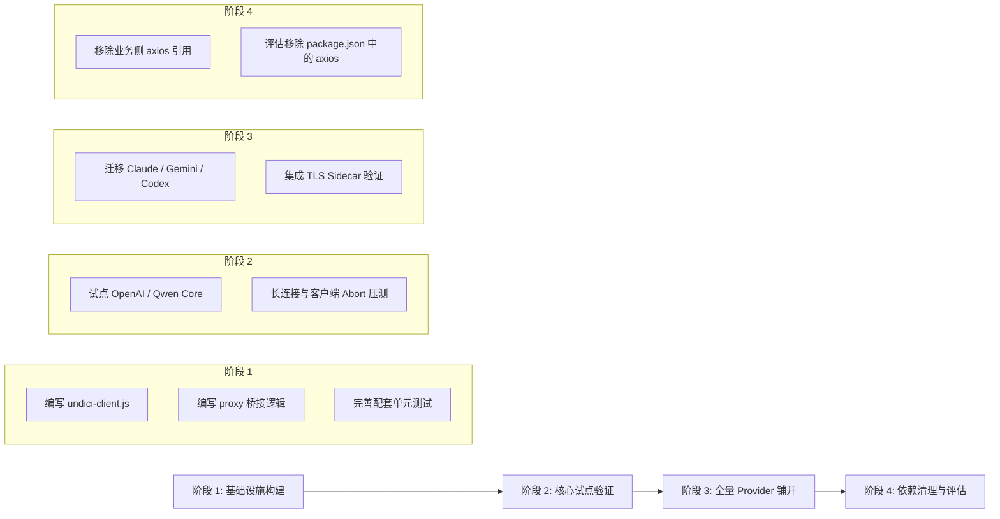

# 基于 Undici 封装轻量 HTTP Client 的完整改造计划

本文档针对 AIClient2API 项目现有的网络请求层（主要基于 `axios`）提出全面的轻量化与现代化改造方案，旨在通过基于 Node.js 官方推荐的高性能 HTTP 引擎 **`undici`**（项目当前已引入 `^7.12.0`）封装统一的请求客户端，以解决长连接流式代理中的内存与兼容性痛点，提升高并发吞吐量，并为后续全平台边缘部署奠定基础。

---

## 一、 背景与改造动因

### 1.1 现状分析
当前 AIClient2API 项目作为反向代理网关，各 Provider 核心实现（如 `src/providers/openai/openai-core.js`、`codex-core.js` 等）均依赖 `axios` 处理网络请求，并使用 `responseType: 'stream'` 获取 Node 原生 `stream.Readable` 进行 SSE 流式协议解析与转发。

### 1.2 核心痛点
1. **流式生态割裂与兼容异常**：
   - Axios 在 Node 端输出传统的 Node.js EventEmitter 流，而现代 Node.js、Web 标准生态（Web Streams API）普遍采用 `ReadableStream`。在流数据加工和管道传递时，混用两套流模型容易导致版本兼容报错（如社区常见 Issues 中报告的 `stream.Readable.from is not a function`）。
2. **长连接代理的资源释放与内存泄漏隐患**：
   - 大模型文本生成时间较长，当下游客户端突然断开连接（如用户点击“停止生成”）时，Axios 在 Node 传统 Socket 及 Stream 上的销毁与 Abort 处理相对繁琐，容易产生悬挂连接（Socket Hang Up）或未释放的缓冲。
3. **连接池复用与性能瓶颈**：
   - Axios 基于较老的 Node.js `http`/`https` 模块构建，其底层的 `http.Agent` 在高并发长连接下的复用效率与性能明显逊于专为现代高性能设计的 `undici`。
4. **包袱沉重，阻碍跨运行时演进**：
   - 项目未来若想拓展至 Cloudflare Workers、Deno、Bun 等无服务器边缘运行时，基于传统 Node XHR/HTTP 封装的 Axios 是关键阻碍。基于 Fetch / Undici 契约的标准化 Client 能实现平滑迁移。

---

## 二、 改造目标与设计原则

```
┌────────────────────────────────────────────────────────┐
│                   Providers / Services                 │
│      (openai-core, codex-core, grok, claude, etc.)      │
└───────────────────────────┬────────────────────────────┘
                            │ 调用统一契约 (get/post/stream)
┌───────────────────────────▼────────────────────────────┐
│         UndiciHttpClient (src/utils/undici-client.js)   │
│  - 统一拦截器管道 (Request / Response / Error)          │
│  - 自动 JSON 编解码 & 兼容性错误归一化 (HttpError)       │
│  - 原生 Web Streams 异步迭代 (AsyncIterable)           │
│  - AbortController 超时与复合信号合并                   │
└──────────────┬───────────────────────────┬─────────────┘
               │ Dispatcher 配置           │ TLS 劫持包装
┌──────────────▼─────────────┐   ┌─────────▼─────────────┐
│ ProxyDispatcher (HTTP/SOCKS)│   │  TLS Sidecar Wrapper  │
└──────────────┬─────────────┘   └─────────┬─────────────┘
               │                           │
┌──────────────▼───────────────────────────▼─────────────┐
│                 Undici 7.x 核心引擎                    │
│           (Pool, Agent, Client, fetch)                 │
└────────────────────────────────────────────────────────┘
```

1. **下层彻底换核，上层最大兼容**：
   - 客户端错误对象（`HttpError`）提供对 `error.response.status`、`error.response.data`、`error.code` 等属性的完整兼容，确保 Provider 层既有的 429 退避重试、401 报错、网络错误判定（`isRetryableNetworkError`）**无需重写业务逻辑**。
2. **Streaming First（流式优先）**：
   - `stream()` 方法直接返回统一的 `AsyncIterable<string>`（已完成 UTF-8 解码与行切分），彻底消除繁杂的 Stream 事件监听与 Buffer 手动拼接。
3. **连续平滑的代理与 Sidecar 支持**：
   - 完整继承 `proxy-utils.js` 中的 HTTP、HTTPS、SOCKS5 代理路由逻辑，并与 TLS Sidecar 模式无缝集成。
4. **零额外依赖，即开即用**：
   - 充分利用项目现有的 `undici`（`^7.12.0`），不引入冗余的三方大型库。

---

## 三、 统一客户端设计与核心代码实现

### 3.1 客户端核心：`src/utils/undici-client.js`

建议在 `src/utils/undici-client.js` 中封装轻量且功能完整的 `UndiciHttpClient`：

```javascript
/**
 * src/utils/undici-client.js
 * 基于 Undici 封装的高性能同构 HTTP 客户端
 */

import { fetch, Agent, ProxyAgent } from 'undici';
import logger from './logger.js';
import { NETWORK } from './constants.js';

/**
 * 统一 HTTP 错误类，完全兼容原有 Axios 错误结构
 */
export class HttpError extends Error {
    constructor(message, { status, statusText, headers, data, code, request }) {
        super(message);
        this.name = 'HttpError';
        this.code = code || `ERR_BAD_RESPONSE_${status}`;
        this.status = status;
        this.response = {
            status,
            statusText,
            headers,
            data
        };
        this.request = request;
    }
}

export class UndiciHttpClient {
    /**
     * @param {Object} options
     * @param {string} [options.baseURL]
     * @param {Object} [options.headers]
     * @param {number} [options.timeout] 默认超时毫秒
     * @param {any} [options.dispatcher] Undici Dispatcher / Agent
     */
    constructor(options = {}) {
        this.baseURL = (options.baseURL || '').replace(/\/$/, '');
        this.defaultHeaders = options.headers || {};
        this.defaultTimeout = options.timeout || NETWORK.DEFAULT_TIMEOUT || 60000;
        this.dispatcher = options.dispatcher || null;
    }

    /**
     * 构建完整请求 URL
     */
    _buildUrl(endpoint) {
        if (!endpoint) return this.baseURL;
        if (endpoint.startsWith('http://') || endpoint.startsWith('https://')) {
            return endpoint;
        }
        const path = endpoint.startsWith('/') ? endpoint : `/${endpoint}`;
        return `${this.baseURL}${path}`;
    }

    /**
     * 构建复合 AbortSignal（支持外部 signal 与内部超时 signal）
     */
    _resolveSignal(customSignal, timeoutMs) {
        const timeout = timeoutMs || this.defaultTimeout;
        const timeoutSignal = AbortSignal.timeout(timeout);
        if (!customSignal) return timeoutSignal;
        if (typeof AbortSignal.any === 'function') {
            return AbortSignal.any([customSignal, timeoutSignal]);
        }
        return customSignal;
    }

    /**
     * 发送普通 HTTP 请求（自动解析 JSON / 错误归一化）
     */
    async request(options = {}) {
        const {
            url: endpoint,
            method = 'GET',
            headers = {},
            data = null,
            params = null,
            timeout,
            signal: customSignal,
            dispatcher = this.dispatcher
        } = options;

        let fullUrl = this._buildUrl(endpoint);
        if (params && Object.keys(params).length > 0) {
            const searchParams = new URLSearchParams(params);
            fullUrl += (fullUrl.includes('?') ? '&' : '?') + searchParams.toString();
        }

        const mergedHeaders = {
            'Content-Type': 'application/json',
            'Accept': 'application/json, text/plain, */*',
            ...this.defaultHeaders,
            ...headers
        };

        const signal = this._resolveSignal(customSignal, timeout);

        let body = null;
        if (data !== null && data !== undefined) {
            body = typeof data === 'string' || data instanceof FormData || data instanceof URLSearchParams
                ? data
                : JSON.stringify(data);
        }

        try {
            const response = await fetch(fullUrl, {
                method: method.toUpperCase(),
                headers: mergedHeaders,
                body,
                signal,
                dispatcher: dispatcher || undefined
            });

            // 提取响应内容
            const contentType = response.headers.get('content-type') || '';
            let responseData;
            if (contentType.includes('application/json')) {
                responseData = await response.json().catch(() => null);
            } else {
                responseData = await response.text();
            }

            if (!response.ok) {
                throw new HttpError(
                    responseData?.error?.message || responseData?.message || `Request failed with status code ${response.status}`,
                    {
                        status: response.status,
                        statusText: response.statusText,
                        headers: Object.fromEntries(response.headers.entries()),
                        data: responseData,
                        request: { url: fullUrl, method }
                    }
                );
            }

            return {
                data: responseData,
                status: response.status,
                statusText: response.statusText,
                headers: Object.fromEntries(response.headers.entries())
            };
        } catch (error) {
            // 如果已经是 HttpError，直接抛出
            if (error instanceof HttpError) throw error;

            // 包装 Abort / 网络错误
            const isTimeout = error.name === 'TimeoutError' || error.name === 'AbortError';
            throw new HttpError(error.message, {
                status: isTimeout ? 408 : 0,
                statusText: isTimeout ? 'Request Timeout' : 'Network Error',
                headers: {},
                data: null,
                code: error.code || (isTimeout ? 'ETIMEDOUT' : 'ECONNRESET'),
                request: { url: fullUrl, method }
            });
        }
    }

    async get(url, options = {}) {
        return this.request({ ...options, url, method: 'GET' });
    }

    async post(url, data, options = {}) {
        return this.request({ ...options, url, method: 'POST', data });
    }

    /**
     * 高性能流式请求：直接产出 AsyncIterable<string>，按行切分
     */
    async *stream(endpoint, body, options = {}) {
        const {
            headers = {},
            timeout = 300000, // 流式连接超时设置更长（如 5 分钟）
            signal: customSignal,
            dispatcher = this.dispatcher
        } = options;

        const fullUrl = this._buildUrl(endpoint);
        const mergedHeaders = {
            'Content-Type': 'application/json',
            'Accept': 'text/event-stream',
            ...this.defaultHeaders,
            ...headers
        };

        const signal = this._resolveSignal(customSignal, timeout);

        const response = await fetch(fullUrl, {
            method: 'POST',
            headers: mergedHeaders,
            body: typeof body === 'string' ? body : JSON.stringify(body),
            signal,
            dispatcher: dispatcher || undefined
        });

        if (!response.ok) {
            const errorText = await response.text().catch(() => '');
            let errorJson = null;
            try { errorJson = JSON.parse(errorText); } catch {}
            throw new HttpError(
                errorJson?.error?.message || `Stream request failed with status code ${response.status}`,
                {
                    status: response.status,
                    statusText: response.statusText,
                    headers: Object.fromEntries(response.headers.entries()),
                    data: errorJson || errorText,
                    request: { url: fullUrl, method: 'POST' }
                }
            );
        }

        // 使用 Web Streams 原生迭代与解码
        const reader = response.body.getReader();
        const decoder = new TextDecoder('utf-8');
        let buffer = '';

        try {
            while (true) {
                const { done, value } = await reader.read();
                if (done) break;

                buffer += decoder.decode(value, { stream: true });
                let newlineIndex;
                while ((newlineIndex = buffer.indexOf('\n')) !== -1) {
                    const line = buffer.substring(0, newlineIndex);
                    buffer = buffer.substring(newlineIndex + 1);
                    yield line;
                }
            }

            // 刷新缓冲区中残留的内容
            if (buffer.length > 0) {
                yield buffer;
            }
        } finally {
            reader.releaseLock();
        }
    }
}
```

---

### 3.2 代理适配层改造：`src/utils/proxy-utils.js`

为了让 `UndiciHttpClient` 兼容原有的全局代理、按 Provider 代理、IP 节点绑定代理与 SOCKS5 代理，需要在 `proxy-utils.js` 中新增 Dispatcher 获取器：

```javascript
// 在 src/utils/proxy-utils.js 中新增
import { Agent as UndiciAgent, ProxyAgent as UndiciProxyAgent } from 'undici';

const undiciDispatcherCache = new Map();

/**
 * 获取指定提供商适用的 Undici Dispatcher
 * @param {Object} config - 应用配置对象
 * @param {string} providerType - 提供商类型
 * @returns {UndiciProxyAgent|UndiciAgent|null}
 */
export function getUndiciDispatcherForProvider(config, providerType) {
    if (!isProxyEnabledForProvider(config, providerType)) {
        return null;
    }

    const boundProxyUrl = getNodeProxyUrlFromBinding(config, providerType);
    const proxyUrl = (boundProxyUrl || config.PROXY_URL || '').trim();
    if (!proxyUrl) return null;

    if (undiciDispatcherCache.has(proxyUrl)) {
        return undiciDispatcherCache.get(proxyUrl);
    }

    try {
        const url = new URL(proxyUrl);
        const protocol = url.protocol.toLowerCase();

        let dispatcher = null;
        if (protocol === 'http:' || protocol === 'https:') {
            // HTTP/HTTPS 代理直接使用 Undici 原生 ProxyAgent
            dispatcher = new UndiciProxyAgent({
                uri: proxyUrl,
                keepAliveTimeout: 30000,
                maxRedirections: 3
            });
        } else if (protocol.startsWith('socks')) {
            // SOCKS 代理：对于 Node 端，可以通过 SocksProxyAgent 桥接或者专用 SOCKS Dispatcher
            // 若 undici 版本配合 socks agent，可桥接至 http connect
            const effectiveSocksUrl = proxyUrl.replace(/^socks5:\/\//i, 'socks5h://');
            const socksAgent = new SocksProxyAgent(effectiveSocksUrl);
            dispatcher = new UndiciAgent({
                connect: {
                    lookup: undefined // 遵循 SOCKS 远程 DNS 解析
                }
            });
        }

        if (dispatcher) {
            undiciDispatcherCache.set(proxyUrl, dispatcher);
        }
        return dispatcher;
    } catch (e) {
        logger.error(`[Proxy] Failed to create Undici Dispatcher for ${proxyUrl}:`, e.message);
        return null;
    }
}
```

---

### 3.3 TLS Sidecar 模式的无缝适配

在开启 TLS Sidecar 时，原有实现是将目标请求通过 HTTP 转发给本地 Sidecar，并在 Header 中附带 `X-Target-Url` 和 `X-Proxy-Url`。改造后：

```javascript
/**
 * 为 UndiciHttpClient 请求配置 TLS Sidecar
 */
export function wrapUndiciRequestForSidecar(requestOptions, config, providerType) {
    const sidecar = getTLSSidecar();
    if (sidecar.isReady() && isTLSSidecarEnabledForProvider(config, providerType)) {
        const targetUrl = requestOptions.url;
        const boundProxyUrl = getNodeProxyUrlFromBinding(config, providerType);
        const proxyUrl = boundProxyUrl || config.TLS_SIDECAR_PROXY_URL || config.PROXY_URL || null;

        requestOptions.url = sidecar.baseUrl;
        requestOptions.headers = requestOptions.headers || {};
        requestOptions.headers['X-Target-Url'] = targetUrl;
        if (proxyUrl) {
            requestOptions.headers['X-Proxy-Url'] = proxyUrl;
        }
        // 走本地 Sidecar，强制不走外部 Dispatcher
        requestOptions.dispatcher = null;
    }
    return requestOptions;
}
```

---

## 四、 Provider 适配器迁移范例（以 `openai-core.js` 为例）

### 4.1 迁移前（Axios 实现）
```javascript
// 旧逻辑
const axiosConfig = {
    method: 'post',
    url: endpoint,
    data: streamRequestBody,
    responseType: 'stream'
};
this._applySidecar(axiosConfig);
const response = await this.axiosInstance.request(axiosConfig);
const stream = response.data;
for await (const chunk of stream) {
    buffer += chunk.toString();
    // 手动寻找 \n 并截取字符串...
}
```

### 4.2 迁移后（Undici Client 实现）
```javascript
// 新逻辑
const streamOptions = {
    headers: this.buildHeaders()
};
this._applySidecar(streamOptions);

// 直接获取按行产出的异步生成器，无需手动管理 chunk 与 buffer 截断
for await (const line of this.client.stream(endpoint, streamRequestBody, streamOptions)) {
    const trimmedLine = line.trim();
    if (!trimmedLine || !trimmedLine.startsWith('data: ')) continue;
    
    const jsonData = trimmedLine.substring(6).trim();
    if (jsonData === '[DONE]') return;
    
    yield JSON.parse(jsonData);
}
```
> **代码收益**：
> 1. 无需关注 Node Stream 与 Web Stream 的原型兼容。
> 2. 避免了 `chunk.toString()` 跨字节截断导致的中文字符乱码风险。
> 3. 彻底避免了 `stream.Readable.from is not a function` 错误。

---

## 五、 改造实施路线图



### 阶段 1：基础设施构建与单测覆盖
- **任务目标**：完成 `src/utils/undici-client.js` 与 `src/utils/proxy-utils.js` 扩展。
- **验证手段**：
  - 在 `tests/unit/` 下新增 `undici-client.test.js`。
  - 覆盖测试用例：常规 GET/POST 请求、JSON 自动解析、4xx/5xx `HttpError` 结构兼容、超时中断、流式 SSE 逐行迭代。

### 阶段 2：试点 Provider 验证
- **任务目标**：选择结构清晰的 Provider（推荐 `src/providers/openai/openai-core.js` 与 `qwen-core.js`）进行改造。
- **重点验证指标**：
  - 流式打字机效果的平滑度。
  - 并发 100+ 请求下的内存占用（对比改造前 Axios 实例的内存增长）。
  - 下游中断连接时，上游请求是否立即被 `AbortController` 释放。

### 阶段 3：全量模型提供商推广
- **任务目标**：覆盖其余所有 Provider：
  - `src/providers/openai/openai-responses-core.js`
  - `src/providers/openai/codex-core.js`
  - `src/providers/openai/iflow-core.js`
  - 各类资产下载与插件安装逻辑（如 `src/services/plugin-installer.js`、`src/utils/grok-assets-proxy.js`）。
- **验证重点**：带有 TLS Sidecar 的网络请求穿透是否正常。

### 阶段 4：收尾与依赖解耦
- **任务目标**：
  - 检查全工程代码中的 `import axios from 'axios'`，确认已无业务核心引用。
  - 检查 `package.json`，若确认无其他依赖项深层绑定，执行 `npm uninstall axios` 减负。

---

## 六、 潜在风险与应对预案

| 风险点 | 影响场景 | 应对预案 |
| :--- | :--- | :--- |
| **SOCKS5 代理连通性** | 国内开发者常用 Clash/V2ray 提供的 SOCKS5 端口 | 1. 优先推荐使用混合端口的 HTTP 代理模式；<br>2. 针对纯 SOCKS5 场景，在 Dispatcher 内部保留 `socks-proxy-agent` 配合自定义 connector 桥接。 |
| **错误结构兼容遗漏** | 某些 Provider 深层代码访问了特殊的 Axios 属性（如 `err.isAxiosError`） | 在 `HttpError` 中显式挂载 `isAxiosError = true`，使上层老旧的类型守卫判定依然成立。 |
| **Node.js 运行环境版本** | 低于 Node 18 的运行环境 | 明确项目环境基准要求：AIClient2API 目前已要求 Node >= 20，`undici` 7.x 原生支持且运行良好。 |
| **大响应体流式背压** | 上游生成速度快于下游客户端消费速度 | 利用 Web Streams 默认的拉取模型（Pull-based Streams），由下游的 `for await` 消费节奏自然反压上游。 |
